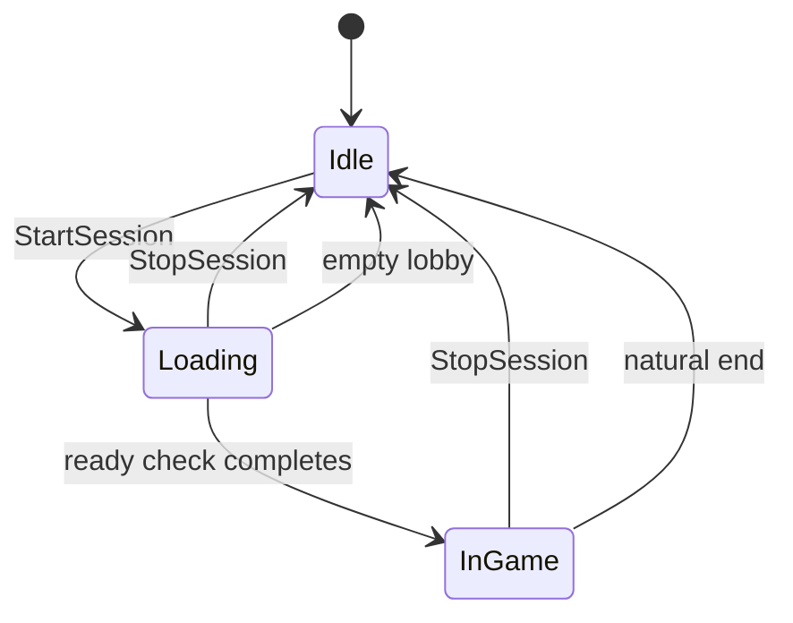

# RankedGameSession

`Tsvrc.Session.RankedGameSession` composes the rest of the tracking and timing stack into a
full round-based game session: a lobby, a synchronized ready-check-gated start, an active
game phase with completion tracking, and a configurable end condition. Its generated shadow
is `TsRankedGameSession`. It's one of the most dependent runtime types in the package: it's
built directly on [`PlayerTracker`](../players-tracking/player-tracker),
[`ReadyCheckProcess`](../players-tracking/ready-check-process), and
[`TsvrcTimer`](../networking-data/tsvrc-timer), so those three pages are real prerequisites,
not just related reading. It has no relationship to [`StateManager`](./state-manager) on the
page before this one; its own `CurrentState` is a plain field, not a `StateManager`
instance. See [Run a full timed round with a lobby](../how-to/running-a-timed-round) for
a task-oriented walkthrough.

## Getting an instance

`RankedGameSession` itself, not just the sub-behaviours it composes, ships as one of
[TsVRC's own default pool entries](../explanations/builtin-registrations)
(`TsBuiltinConfig`).

- **Default:** `[WirePool][SerializeField] private RankedGameSession _session;` just
  resolves, nothing to register in Configure first, and codegen calls `TsConstruct` for
  you at wire time.
- **Manual:** skip pooling entirely. Drag the shipped `RankedGameSession` prefab into your
  scene and call `TsConstruct` on it yourself, since nothing does that for an instance
  nobody registered anywhere.

## What it's built from

Five pooled ([`WirePoolAttribute`](../core-concepts/core-attributes)) sub-behaviours, wired
up by codegen rather than assigned by hand:

- `_lobbyTracker` (`PlayerTracker`) — who's in the lobby, before a round starts.
- `_readyCheck` (`ReadyCheckProcess`) — gates the transition from lobby to active game.
- `_gameTracker` (`PlayerTracker`) — who's actively playing the current round.
- `_completedTracker` (`PlayerTracker`) — who has finished the current round.
- `_timer` (`TsvrcTimer`) — an optional round duration.

`RankedGameSession` itself carries no state about *why* a game is won or lost. It only
manages phase transitions and player-set bookkeeping; your own subclass or event subscribers
decide what "completed" or "should end" actually means for your game.

## The state machine

`CurrentState` is one of `RankedGameSessionState.Idle`, `Loading`, or `InGame`. It's a plain
local field, not re-derived from the sub-trackers' own synced state on every read: `TsStart`
seeds it once from that live state (safe only there, since a late-joining client's
sub-trackers are already fully synced by the time its own scripts start running), and from
then on `RankedGameSession`'s own code sets it directly at each transition, whether that
code is running in response to a subscribed sub-behaviour event or, for `StopSession`
specifically, directly inside the call itself. Re-deriving it live on every read instead
would go stale on any client that doesn't own that particular sub-process.



## Running a session

```csharp
session.StartLobbyTracking();
session.AddLobbyPlayer(somePlayerId);
// ... later ...
session.StartSession();
// each client, once ready:
session.SetReady();
// ... a round is now InGame; your game logic calls:
session.AddCompletedPlayer(somePlayerId);
```

`StartLobbyTracking`/`StopLobbyTracking` are thin forwards to `_lobbyTracker`'s own
tracking. `AddLobbyPlayer`/`RemoveLobbyPlayer` add or remove one player from the lobby, and
both require `StartLobbyTracking` to have run first: calling either before that logs an
error and does nothing, rather than silently queuing the player for later.

`StartSession` snapshots the current lobby roster and starts the ready check over it; it
logs an error and does nothing if a session is already running (`CurrentState` isn't
`Idle`). It takes an optional `additionalKnownPresentPlayerIds`: extra IDs unioned into that
initial snapshot even if `_lobbyTracker`'s own synced state hasn't caught up to them yet,
since a caller's own local knowledge (say, a trigger volume's roster) can be ahead of what's
propagated over the network. Starting with an empty roster is rejected outright with an
error, rather than allowed to silently hang: `ReadyCheckProcess.CheckAllPlayersReady` never
auto-completes on a zero-length tracked list, so an empty-lobby start would otherwise leave
the session stuck in `Loading` forever with nothing able to complete it except a manual
`StopSession`.

`AddLoadingParticipant` lets a player join an *already-running* ready check that they
weren't part of the original snapshot: useful for a game that becomes eligible to more
players over time without waiting for the next round. It's a no-op outside `Loading` and for
a player already tracked, matching the underlying `AddTrackedPlayers` semantics it forwards
to.

Once `InGame`, `RemoveGamePlayer` drops a player from `_gameTracker` directly, for a player
leaving the round early without leaving the instance (a respawn, an exit trigger); it's a
no-op outside `InGame`. `SetTimerDuration(ms)` overrides the inspector-configured round
length at runtime; it only takes effect the next time the ready check completes and
`_timer.StartTimer` actually runs, so call it any time before that moment, including while a
session is already `Loading`, not while a round is already `InGame`.
`GetRemainingMilliseconds()` forwards to the round timer directly, for a HUD that doesn't
want to hold its own reference to `_timer`.

## Ending a session

Four independent, individually toggleable natural end conditions
(`_endOnTimerComplete`, `_endOnAllGamePlayersLeft`, `_endOnAllPlayersCompleted`,
`_stopOnEmptyLobbyDuringLoading`) plus an explicit `StopSession()` call. Each maps to its own
`RankedGameSessionEndReason` value, readable via `LastEndReason` once the corresponding event
fires. `_stopOnEmptyLobbyDuringLoading` exists for the same underlying reason the empty-lobby
start guard does: `CheckAllPlayersReady` can't complete a check with nobody left tracked, so
losing every remaining player during `Loading` needs an explicit stop or the session hangs
there permanently, one phase earlier than the equivalent `_endOnAllGamePlayersLeft` check.

**`StopSession` reaches every client during `Loading`, but not during `InGame`.** The two
branches behave differently, and the difference matters if you're building a networked
"force stop" button.

During `Loading`, `StopSession` calls `_readyCheck.StopReadyCheck()`, an ordinary `Process`
call: it forwards to the real owner if the caller isn't it, and the owner's stop already
broadcasts to every instance player, the same way every other `ReadyCheckProcess`/
`PlayerTracker` state change does. `RankedGameSession` subscribes to that broadcast
(`OnReadyCheckStoppedEvent`), so every client's own bookkeeping updates on its own once it
arrives, with no extra work from you.

During `InGame`, `StopSession` instead calls `_EndSession` directly: `CurrentState`,
`LastEndReason`, and `OnSessionStoppedEvent` are all set and fired immediately and
synchronously, on the calling client only, before `_StopSubProcesses()` even asks
`_gameTracker`/`_completedTracker`/`_timer` to stop (and each of those calls is itself
subject to the same owner-forwarding as any other `Process` call). Those three sub-processes
do eventually stop and broadcast that to every client once their real owner processes it,
but `RankedGameSession` isn't subscribed to any of *their* stop events, only to their
players-added/players-removed/timer-completed events, so nothing re-runs its own bookkeeping
on other clients when that stop arrives. **A client that didn't call `StopSession` itself
during `InGame` never sees its own `CurrentState` return to `Idle`.**

`RankedGameSession` carries no authorization or broadcast policy of its own (who's allowed
to stop a session, and how that reaches every client): that's entirely the caller's
responsibility. A networked "force stop" button needs to broadcast the `StopSession` call to
itself across clients to cover the `InGame` case; the `Loading` case already gets there
through the ready check's own networking.

## Reading player state safely from inside an end event

`GamePlayerIds`/`CompletedPlayerIds` read live off the sub-trackers, which are already being
torn down by the time `OnSessionEndedEvent`/`OnSessionStoppedEvent` actually fire: reading
them from inside those events' handlers sees either an already-emptied result (on whichever
client owns the sub-tracker being stopped) or a stale one that hasn't caught up yet (on
every other client), never reliably the picture at the moment the round actually ended. Use
`LastEndedGamePlayerIds`/`LastEndedCompletedPlayerIds` instead: both are snapshotted
immediately before the sub-trackers are torn down, on every client, specifically so a
subscriber to the end events has accurate data to work with regardless of ownership.
`LoadingPlayerIds` has a related but distinct subtlety: it reads the ready check's own
roster (which can be broader than `LobbyPlayerIds`, thanks to
`additionalKnownPresentPlayerIds`), so use it rather than `LobbyPlayerIds` to check whether a
player is part of the round currently loading.

```csharp
session.TsSubscribe(this, RankedGameSession.OnSessionEndedEvent, nameof(_OnRoundOver));
session.TsSubscribe(this, RankedGameSession.OnSessionStoppedEvent, nameof(_OnRoundOver));

public void _OnRoundOver()
{
    // GamePlayerIds is unreliable here - the sub-trackers are already being torn
    // down by the time this fires. Use the snapshot instead.
    if (TsArray.Contains(session.LastEndedGamePlayerIds, localPlayerId))
        AwardCompletionBonus();
}
```

## Events

Eight of nine events pair a `protected virtual` hook with a public string constant for
`TsSubscribe`, firing the hook first, matching the convention used throughout the tracking
chain; `OnTimerUpdatedEvent` is a plain forward of the round timer's own tick, with no
matching hook of its own.

| Hook | Event constant | Fires when | Read |
|---|---|---|---|
| `OnSessionLoading` | `OnSessionLoadingEvent` | `StartSession` begins the ready check | `LobbyPlayerIds` |
| `OnSessionStarted` | `OnSessionStartedEvent` | The ready check completes and the round goes `InGame` | `LobbyPlayerIds` |
| `OnSessionStopped` | `OnSessionStoppedEvent` | `StopSession` (either phase), or (with `_stopOnEmptyLobbyDuringLoading`) the lobby emptying while `Loading` | `LastEndedGamePlayerIds`/`LastEndedCompletedPlayerIds`, `LastEndReason` |
| `OnSessionEnded` | `OnSessionEndedEvent` | A natural end condition fires (timer expired, all active players left, all players completed) | same as above |
| `OnLobbyPlayerAdded` | `OnLobbyPlayerAddedEvent` | A player is added to the lobby | `LastAddedLobbyPlayerIds` |
| `OnLobbyPlayerRemoved` | `OnLobbyPlayerRemovedEvent` | A player is removed from the lobby, including [automatically on leaving or suspending](../players-tracking/player-tracker#automatic-removal) | `LastRemovedLobbyPlayerIds` |
| `OnGamePlayerRemoved` | `OnGamePlayerRemovedEvent` | A player leaves `_gameTracker` during `InGame` | `LastRemovedGamePlayerIds` |
| `OnPlayerCompleted` | `OnPlayerCompletedEvent` | `AddCompletedPlayer` succeeds | `LastCompletedPlayerIds` |
| (none) | `OnTimerUpdatedEvent` | Forwarded from the round timer's own `OnTimerUpdatedEvent` | — |

`LobbyPlayerIds` is what both `OnSessionLoadingEvent` and `OnSessionStartedEvent` document
reading, even though the round is already using the ready check's broader roster
(`LoadingPlayerIds`) by the time it starts; read `LoadingPlayerIds` instead if a player was
added via `AddLoadingParticipant`.

## GetPlayerStatus

`GetPlayerStatus(playerId)` derives a single `RankedGamePlayerStatus` value
(`NotInSession`/`InLobby`/`Loading`/`Playing`/`Completed`) from the tracker arrays already
available on any client at any moment. It introduces no new synced state, just a
consumer-friendly read over state that already exists, replacing what would otherwise be
manual cross-referencing of three or four separate ID arrays.
